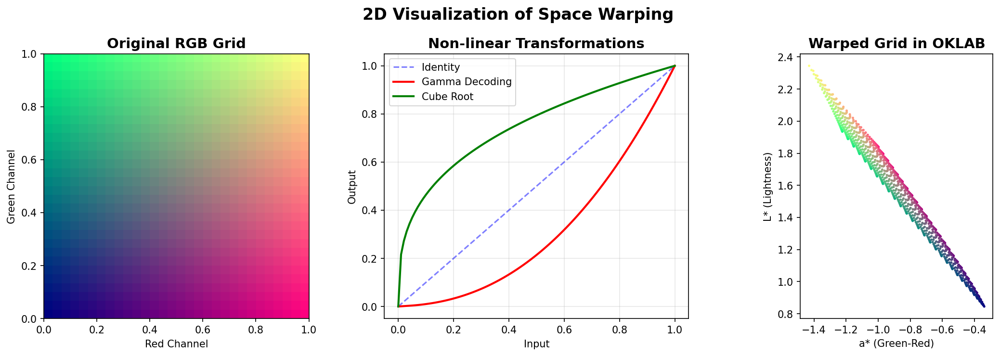
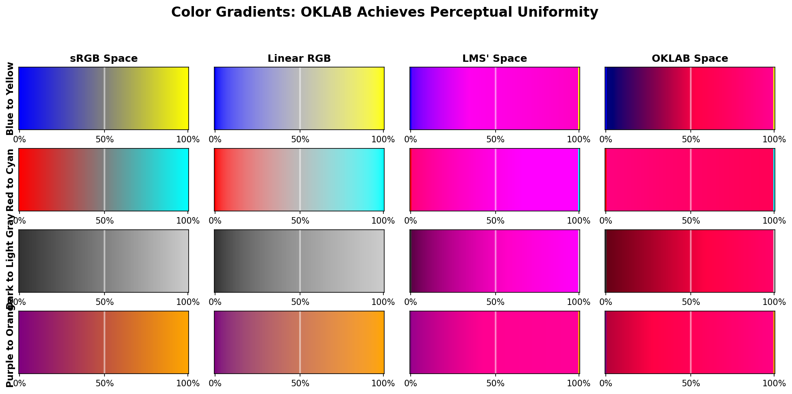
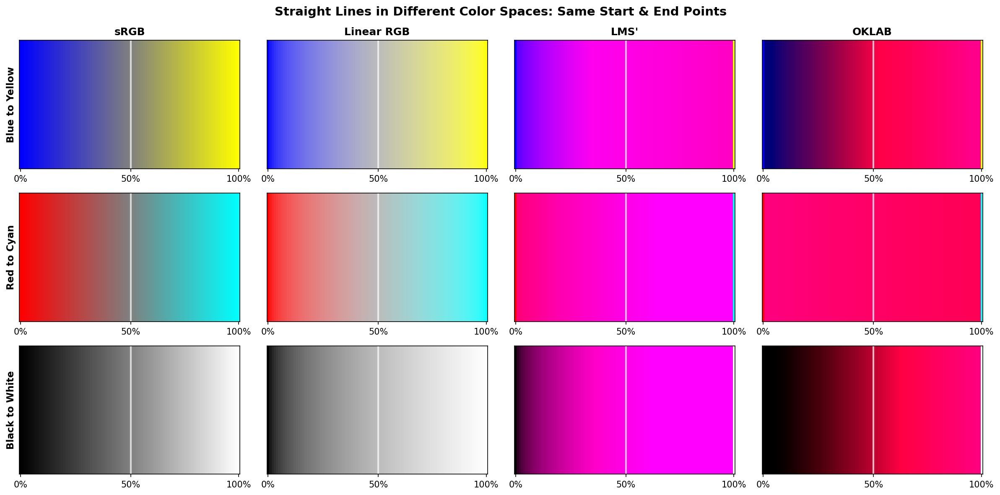

# Color Space Transformation: Mathematical Exploration of sRGB to OKLAB

## Project Overview

This repository provides a comprehensive exploration of color space transformations, specifically the mathematical journey from sRGB to OKLAB. Through interactive visualizations and detailed analysis, it demonstrates how non-linear transformations create perceptually uniform spaces - a concept with applications ranging from image processing to analog circuit design optimization.

## Key Features

- **Mathematical Analysis**: Deep dive into the transformation pipeline from sRGB to OKLAB
- **Interactive Visualizations**: 2D and 3D visualizations of color space warping
- **Perceptual Uniformity**: Demonstrations of how OKLAB achieves perceptual uniformity
- **Cross-Domain Applications**: Exploration of how these concepts apply to analog circuit layout

## Quick Start

### Prerequisites

```bash
# Install uv package manager (if not already installed)
curl -LsSf https://astral.sh/uv/install.sh | sh

# Clone the repository
git clone https://github.com/buzzant/Color-Space-Transformation.git
cd Color-Space-Transformation

# Install dependencies
uv sync
```

### Running Examples

```bash
# Generate all visualization plots
uv run src/visualizations/generate_plots.py

# Run 2D warping visualization
uv run src/visualizations/oklab_accurate_warp_viz_2d.py

# Run 3D cube transformation
uv run src/visualizations/oklab_accurate_warp_viz_3d.py

# Run color analysis
uv run src/analysis/oklab_analysis.py
```

## Project Structure

```
Color-Space-Transformation/
├── README.md                          # This file
├── pyproject.toml                     # Project dependencies
├── main.py                           # Main entry point
│
├── src/
│   ├── visualizations/               # Visualization scripts
│   │   ├── generate_plots.py         # Generate all plots
│   │   ├── oklab_accurate_warp_viz_2d.py  # 2D warping visualization
│   │   └── oklab_accurate_warp_viz_3d.py  # 3D cube transformation
│   │
│   └── analysis/                     # Analysis scripts
│       ├── oklab_analysis.py         # Mathematical analysis
│       ├── color_gradient_comparison.py  # Gradient comparison
│       ├── color_line_comparison.py  # Line segment analysis
│       └── color_line_proof.py       # Mathematical proofs
│
├── docs/                             # Documentation
│   ├── sRGB to OKLAB.md            # Transformation formulas
│   ├── space_warping_mathematics.md # Detailed mathematics
│   ├── performance_space_warping.md # Theoretical framework
│   └── analog_layout_automation_discussion.md  # Circuit applications
│
└── plots/                            # Generated visualizations
    ├── 2d_warping.png               # 2D transformation steps
    ├── 3d_transformation.png        # 3D cube warping
    ├── corner_mapping.png           # RGB corners in OKLAB
    ├── gradient_comparison.png      # Gradient analysis
    └── line_comparison.png          # Line preservation analysis
```

## Mathematical Foundation

### The Transformation Pipeline

```
sRGB → [Gamma Decode] → Linear RGB → [Matrix M₁] → LMS' → [Cube Root] → LMS → [Matrix M₂] → OKLAB
```

Each transformation step serves a specific purpose:

1. **Gamma Decoding**: Linearizes the perceptually-encoded sRGB values (γ = 2.4)
2. **RGB → LMS'**: Transforms to cone response space (human eye physiology)
3. **Cube Root**: Applies perceptual compression (Stevens' Power Law)
4. **LMS → OKLAB**: Creates opponent color axes (L/a/b channels)

### Key Mathematical Properties

#### Volume Compression
The RGB cube undergoes significant compression through the transformation:

| Transformation Step | Volume Factor | Cumulative |
|--------------------|---------------|------------|
| Original sRGB      | 1.000         | 1.000      |
| After Gamma        | ~0.350        | 0.350      |
| After RGB→LMS'     | ×0.157        | 0.055      |
| After Cube Root    | ~0.500        | 0.028      |
| After LMS'→OKLAB   | ×2.670        | 0.074      |

**Final Result**: ~7.4% of original volume

#### Space Dimensions
OKLAB has an intentional aspect ratio of approximately **5:2:1** (L:a:b):
- **L** (lightness): Range [0, 1]
- **a** (green-red): Range [-0.4, 0.4]
- **b** (blue-yellow): Range [-0.3, 0.2]

This reflects human vision's greater sensitivity to lightness changes over chromatic variations.

## Visualizations

### RGB Cube to OKLAB Transformation


Shows the complete transformation of the RGB cube through each mathematical step.

### 2D Warping Analysis


Demonstrates how a 2D slice of color space is warped through the transformation pipeline.

### Gradient Comparison


Compares color gradients in RGB vs OKLAB space, showing improved perceptual uniformity.

### Line Preservation


Analyzes how straight lines in RGB space become curves in OKLAB space.

## Applications

### Image Processing
- Perceptually uniform color adjustments
- Better color difference calculations
- Improved color palette generation

### Computer Graphics
- More natural color interpolation
- Better HDR tone mapping
- Perceptually uniform gradients

### Analog Circuit Design
- Performance-aware placement optimization
- Parasitic-sensitive routing strategies
- Thermal-aware floorplanning

### Machine Learning
- Better color features for vision models
- Perceptually meaningful loss functions
- Color-based clustering and segmentation

## Mathematical Details

For detailed mathematical derivations and proofs, see:
- [sRGB to OKLAB Formulas](docs/sRGB%20to%20OKLAB.md)
- [Space Warping Mathematics](docs/space_warping_mathematics.md)
- [Performance Space Warping Theory](docs/performance_space_warping.md)

## Contributing

Contributions are welcome! Areas of interest include:
- Additional color space transformations (LAB, HSV, etc.)
- Performance optimizations
- New visualization types
- Applications to other domains

## References

- [OKLAB Color Space](https://bottosson.github.io/posts/oklab/) by Björn Ottosson
- [A perceptual color space for image processing](https://bottosson.github.io/misc/colorpicker/)
- Stevens, S. S. (1957). "On the psychophysical law"
- CIE Color Space specifications

## License

MIT License - See LICENSE file for details

## Author

Donghyun Lee (buzzant)

---

*"Transforming color spaces to match human perception - where mathematics meets vision."*